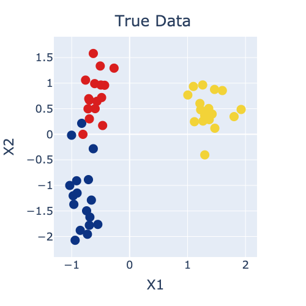
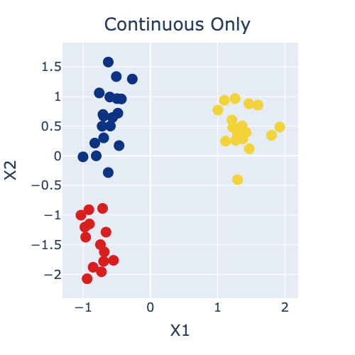
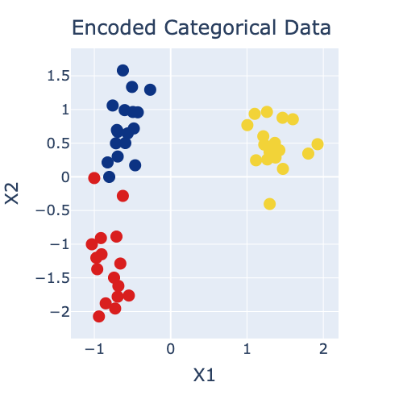
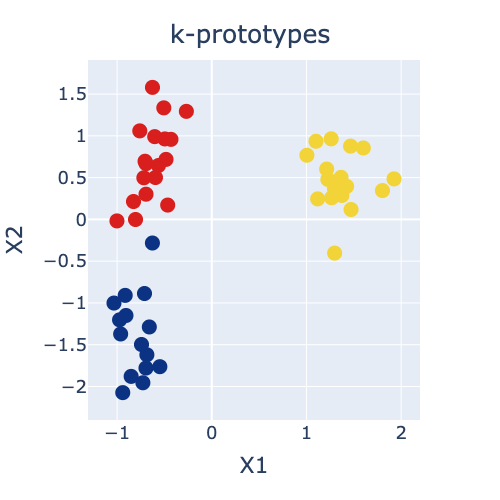
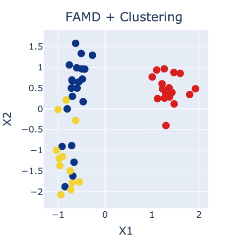

## Introduction
Recently I had to do some clustering of data that contained both continuous and categorical features. Standard clustering algorithms like k-means and DBSCAN don't work with categorical data. After doing some research, I found that there wasn't really a standard approach to the problem. So, I came up with a few different approaches, the practical implementations of which I'm documenting here and which I plan to come back to investigate further at some point:

1. Cluster using e.g., k-means or DBSCAN, based on only the continuous features;
2. Numerically encode the categorical data before clustering with e.g., k-means or DBSCAN;
3. Use k-prototypes to directly cluster the mixed data;
4. Use FAMD (factor analysis of mixed data) to reduce the mixed data to a set of derived continuous features which can then be clustered.

I'll describe each approach in a little more detail below, but first, if you plan to follow along, you'll need to install the [prince](https://github.com/kormilitzin/Prince) and [kmodes](https://github.com/nicodv/kmodes) Python packages:

```python
pip install prince
pip install kmodes
```

The post comes with a Jupyter notebook which you can find [here on Github](https://github.com/TomasBeuzen/machine-learning-tutorials/blob/master/ml-clustering/clustering-mixed-data.ipynb). Let's get to our Python imports:

```python
import numpy as np
import pandas as pd
from prince import FAMD
from sklearn.datasets import make_blobs
from sklearn.cluster import KMeans
from kmodes.kprototypes import KPrototypes
from sklearn.preprocessing import StandardScaler
random_state = 1234
pd.options.plotting.backend = "plotly"
```

I also defined a custom plotting function to use in this post which leverages Pandas brand new [plotly plotting backend](https://plotly.com/python/pandas-backend/):

```python
def plot_cluster(X, y, title="Cluster plot"):
    fig = X.plot.scatter(x='X1', y='X2', color=y)
    fig.update_layout(autosize=False, width=500, height=500,
                  coloraxis = dict(showscale=False, colorscale='Portland'),
                  font=dict(size=18),
                  title=dict(text=title, x=0.5, y=0.95, xanchor='center'))
    fig.update_traces(marker=dict(size=15))
    return fig
```

Finally, I'll create some synthetic data to demonstrate the clustering methods discussed in this post. The data will have 50 observations, 3 features and 3 clusters. I standardise the numerical data with sklearn's `StandardScaler()` for clustering purposes (to make sure all features are on the same scale), and pretty arbitrarily convert one of the features to a categorical of "LOW" and "HIGH" values to demonstrate different approaches to clustering mixed data.

```python
X, y = make_blobs(n_samples=50, centers=3, n_features=3, random_state=random_state)
X = pd.DataFrame(X, columns=['X1', 'X2', 'X3'])
X['X3'] = np.where(X['X3'] < 0, 'LOW', 'HIGH')
con_feats = ['X1', 'X2'] 
cat_feats = ['X3']
scale = StandardScaler()
X[con_feats] = scale.fit_transform(X[con_feats])
X.head()
```

|     | X1        | X2        | X3   |
| --- | --------- | --------- | ---- |
| 0   | -0.495194 | 0.963114  | HIGH |
| 1   | -0.548021 | -1.762852 | LOW  |
| 2   | 1.101047  | 0.935499  | LOW  |
| 3   | -0.694720 | -1.779252 | LOW  |
| 4   | 1.261093  | 0.964404  | LOW  |

Let's plot our synthetic data (using our two continuous features as the `x` and `y` axes). There are 3 quite distinct blobs shown in blue, red, and yellow. However, there is a bit of mixture evident in the blue and red blobs and it will be interesting to explore how our different clustering approaches can capture this.

```python
plot_cluster(X, y, title="True Data")
```


__*Figure 1: Scatter plot of synthetic data coloured by true labels.*__


## 1. Cluster based on continuous data only
The first question I asked myself when dealing with my mixed data was "Do I really need the information contained in the categorical features to extract patterns in my dataset?". It could be that the continuous features available to you in your mixed data are adequate for grouping the data into representative clusters. So the first thing we'll try here is to simply ignore our single categorical feature (which standard algorithms like k-means and DBSCAN don't like), and only cluster based on our continuous features.

```python
model = KMeans(n_clusters=3, random_state=random_state).fit(X[con_feats])
pred = model.labels_
plot_cluster(X, pred, title="Continuous Only")
```


__*Figure 2: Clustering based on only the continuous features.*__

The results are not too bad, we pick up the 3 main clusters, but do not identify that mixed data around (`X1=-1`, `X2=0`) evident in the true data (Figure 1).

## 2. Encode the cateogircal data before clustering
Next we'll try encoding the categorical data using one hot encoding so that we can include it in k-means clustering (note that you may also want to try scaling the data after OHE but I didn't do that here for succinctness).

```python
model = KMeans(n_clusters=3, random_state=random_state).fit(pd.get_dummies(X))
pred = model.labels_
plot_cluster(X, pred, title="Encoded Categorical Data")
```


__*Figure 3: Clustering after one hot encoding the categorical feature.*__

The results are better than before, we get our 3 blobs, plus we identify some of that mixed data around (`X1=-1`, `X2=0`).

## 3. Use the k-prototypes algorithm
The k-prototypes algorithm can work directly with the categorical data, without the need for encoding. I defer to the [k-prototypes documentation](https://github.com/nicodv/kmodes) and the original paper by [Huang (1997)](https://grid.cs.gsu.edu/~wkim/index_files/papers/kprototype.pdf) for an explanation of how the algorithm works.

```python
pred = KPrototypes(n_clusters=3).fit_predict(X, categorical=[2])
plot_cluster(X, pred.astype(float), title="k-prototypes")
```


__*Figure 4: Clustering using k-prototypes.*__

The results are similar to the above, we get our 3 blobs, plus we identify some of that mixed data around (`X1=-1`, `X2=0`).

## 4. Use FAMD to create continuous features for clustering

Our final approach is to use FAMD (factor analysis for mixed data) to convert our mixed continuous and categorical data into derived continuous components (I chose 3 components here). I defer to the [Prince documentation](https://github.com/kormilitzin/Prince) for an explanation of how the FAMD algorithm works.

Here is an example of the 3 derived components for the first 5 observations in our synthetic dataset.

```python
famd = FAMD(n_components=3).fit(X)
famd.row_coordinates(X).head()
```

|     | Component 1 | Component 2 | Component 3 |
| --- | ----------- | ----------- | ----------- |
| 0   | -0.134396   | 7.103708    | -0.530751   |
| 1   | 7.067240    | 0.113685    | 1.561657    |
| 2   | 7.090335    | 0.082113    | -1.083236   |
| 3   | 7.060651    | 0.122537    | 1.649692    |
| 4   | 7.097300    | 0.072753    | -1.186533   |

```python
model = KMeans(n_clusters=3, random_state=random_state).fit(famd.row_coordinates(X))
pred = model.labels_
plot_cluster(X, pred, title="FAMD + Clustering")
```


__*Figure 5: Clustering using FAMD.*__

The results are interesting here, we do get our 3 blobs but the bottom left blob is not very uniform. However, we perfectly identify the mixed labels around (`X1=-1`, `X2=0`), which no previous approach has been able to do.

## Summary
In this post I documented a few approaches for clustering mixed continuous and categorical data. As always with data science, there is no one approach suited to all problems - in my opinion, clustering in particular is as much an art as a science. But, for the specific real-world application I was working on, I ended up going with approach number 4 (FAMD + clustering), because it yielded the best results for my dataset (which was significantly more complex than the one in this post, with ~400 mixed categorical and continuous features).