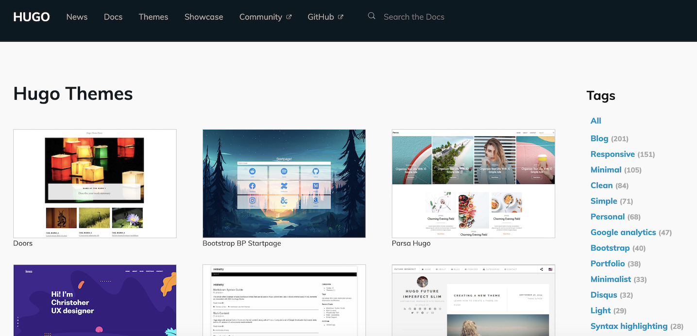
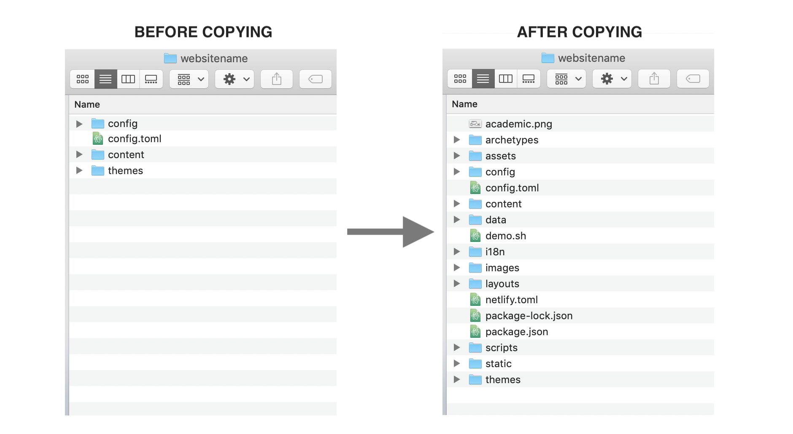

## Introduction
I recently decided I wanted to create this personal website to serve as my online bio and to display various research and personal projects I am/have worked on. To my surprise, this actually turned out to be much easier than anticipated! So in this brief post I'll walk you through how I created this website (for free!) in 5 simple steps using the static site generator [Hugo](https://gohugo.io/) and the static site hosting service provided by [GitHub Pages](https://pages.github.com/).

1. [Install Hugo and get a GitHub account](#1)
2. [Set up a workspace](#2)
3. [Choose a theme for your website](#3)
4. [Creating your website](#4)
5. [Hosting your website on GitHub Pages](#5)
6. [Updating your website](#6)

*UPDATE 2020: The Academic Theme, which is one of the most popular Hugo website themes and the one I use in this post, now has [excellent documentation](https://sourcethemes.com/academic/docs/) for setting up a website quickly and easily - check it out for up-to-date details on building a personal website with Hugo.*

## Step 1: Install Hugo and get a GitHub account <a name="1"></a>

As I'm a mac user, I'll provide instructions here for installing Hugo on macOS. For instructions on installing Hugo on Windows or Linux, go to the [Hugo Installation Page](https://gohugo.io/getting-started/installing/) and then skip to Step 2. To install Hugo on macOS, you'll ned both Homebrew and Go. Homebrew is a free and open-source software package management system that simplifies the installation of software on macOS and Go is a programming language created by Google that Hugo will leverage to create your website framework. If you don't have Homebrew or Go installed on your computer, run the following in the terminal:

```shell
$ /usr/bin/ruby -e "$(curl -fsSL https://raw.githubusercontent.com/Homebrew/install/master/install)"

$ brew install go
```

Now, to install Hugo simply type:

```shell
$ brew install hugo
```

Finally, if you don't already have a GitHub account, head over to the [GitHub website](https://github.com/) and create one.

## Step 2: Set up a workspace <a name="2"></a>

The next thing we need to do is create a directory from which we will build our website, this can be anywhere you like on your computer. You can create a directory using the macOS Finder or Windows File Explorer GUIs, or alternatively by using the command line. For example, the code below creates a new directory called __*websites*__ in the __*Documents*__ folder:


```shell
$ cd ~/Documents

$ mkdir websites
```

Now, from the command line, change into your new directory:

```shell
$ cd websites
```

In this directory we will use Hugo to create the framework for your website. Simply type the following with __*"websitename"*__ replaced with whatever you want to call your website:

```shell
$ hugo new site websitename
```

After executing this command, you will see something like the following:

```shell
Congratulations! Your new Hugo site is created in ~/Documents/websitename.

Just a few more steps and you are ready to go:

1. Download a theme into the same-named folder.
   Choose a theme from https://themes.gohugo.io/ or
   create your own with the "hugo new theme <THEMENAME>" command.
2. Perhaps you want to add some content. You can add single files
   with "hugo new <SECTIONNAME>/<FILENAME>.<FORMAT>".
3. Start the built-in live server via "hugo server".

Visit https://gohugo.io/ for quickstart guide and full documentation.
```

Change into your newly created  __*websitename*__ directory and view the contents using `ls`:

```shell
$ cd websitename

$ ls

archetypes	content		layouts		themes
config.toml	data		static
```

These files and folders form the framework of your Hugo site. We'll explore them a little more later but for now, notice the __*themes*__ folder. In the next step we will select a theme for your website and place it in this folder.

## Step 3: Choose a theme for your website! <a name="3"></a>

With Hugo you can create your very own website theme or download one of many different pre-made, open source themes. There are plenty of really great pre-made themes and they are perfect for getting your website up and running as quickly as possible. Head over to the [Hugo themes page](https://themes.gohugo.io/) and select a theme for your website. I used the [Academic theme](https://themes.gohugo.io/academic/) for my website.


__*The gallery of themes available to build a website with Hugo.*__

Once you've found a theme you like, click the __*download*__ button which will take you to the theme's GitHub repository. In the repository click the green __*Clone or download*__ button and copy the https web URL. Go back to your terminal, `cd` to the __*themes*__ directory and clone the repository:

```shell
$ cd themes

$ git clone https://github.com/gcushen/hugo-academic.git

archetypes	content		layouts		themes
config.toml	data		static
```

You can type `ls` to see that you now have a directory called __*hugo-academic*__ (or whatever other theme you chose). Now `cd` into that directory and again type `ls` to see the content of the directory; these are the files and folders you will need to create your website.

## Step 4: Creating your website <a name="4"></a>

I found that the quickest (and dirtiest) way to get your website up and running is to simply copy everything in the folder __*exampleSite*__ to your directory __*websitename*__ - overwrite any duplications. Once you've done that, go ahead and copy all the other folders and files in __*hugo-acaemic*__ (except for the __*exampleSite*__ folder, __*theme.toml*__, __*README.md*__ and __*LICENSE.md*__) to your directory __*websitename*__ - again, overwrite any duplications.


__*Example of what your directory might look like before and after copying the necessary files.*__

Now you can see what your website currently looks like by changing to the directory __*websitename*__ and typing:

```shell
$ hugo server
```

This renders a local version of your website so you can see it and make changes before putting it online. Copy and paste the url output (e.g., __*http\://localhost:1313*__) into your browser of choice to see your website.

At this point go ahead and spend some time customizing your website. I recommend reading the documentation of the theme you chose to help navigate the folder and create new content. For example, [here](https://sourcethemes.com/academic/docs/) is the documentation for the academic theme. As you make changes, you should see that your website updates automatically in your browser - if for some reason it doesn't, simply `ctrl+c` in your terminal, re-execute `hugo server`, and refresh your browser.

### Step 5: Hosting your website on GitHub Pages <a name="5"></a>

Once you're ready to show your shiny new website to the world, we can host it on GitHub Pages.

The first thing you need to do is go to [GitHub](https://github.com/) and create two empty repositories:

1. a repository with the same name as the website directory you created: 'websitename'; and,
2. a repository with the name 'yourgithubusername.github.io'.

If you haven't created a repository before, simply click your GitHub profile at the top right-hand corner of the screen to see a drop-down menu, click __*Your repositories*__ and on that page you will se a green button __*New*__ which will help you create a repository. Once you've done that, copy the https key from the repository you created with the same name as your website and then in the terminal `cd` to your local directory __*websitename*__ and type:

```shell
 $ git init

 $ git remote add origin https://github.com/User/websitename.git

 $ git push -u origin master
```

This will create a git directory, link it to the remote GitHub repository and then push the contents of the local directory to the remote. Note that the `-u` argument specifies the master branch of the remote as "upstream", meaning that in the future, a simple `git push` will suffice when pushing changes to the remote.

Now copy the https key from the repository you created with the name __*yourgithubusername.github.io*__ and copy the https key. Then `cd` back to your initial __*websites*__ directory and type:

```shell
$ git clone https://github.com/User/yourgithubusername.github.io.git # Clone the remote repo

$ cd websitename # Change directory

$ hugo -d ../yourgithubusername.github.io # Deploy your website

$ cd ../yourgithubusername.github.io

$ git add .

$ git commit -m "first commit"

$ git push -u origin master
 ```

And that's it! Go to GitHub and go to the repository __*yourgithubusername.github.io*__, click the settings tab near the top of the page and scroll down to the subheading __*GitHub Pages*__ where you will see the link to your new website: `http://yourgitubusername.github.io`. Click the link to see your website out in the wild. Congratulations - you can now show off your work to the world (wide web)!

## Step 6: Updating your website <a name="6"></a>

If you are going to have content on your website that will change over time (e.g., writing posts, updating research projects, changing your job title, etc.) then you'll need to know how to make these changes to your website. Luckily, this is as easy as pie. Make any changes/additions to your website in your local directory __*websitename*__ (remember to use `hugo server` to render a local version of your website that you can view before deploying it online). Once you've made your changes make sure you're in the __*websitename*__ directory and type the following commands in terminal to push your local changes to the remote, re-deploy your website `yourgithubusername.github.io` and then push that to the remote too:

```shell
$ git add .

$ git commit -m "some changes"

$ git push # push all changes to the remote

$ hugo -d ../yourgithubusername.github.io # re-deploy website

$ cd ../yourgithubusername.github.io

$ git add .

$ git commit -m "some changes"

$ git push
```

After this, you may need to wait ~10 minutes for the changes to take effect on the online version of your website.